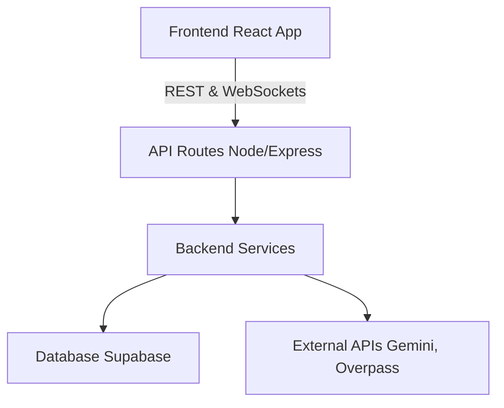

# Project Information

**Project Name**: SafeSphere
**Project Description**: A comprehensive safety application designed to provide real-time journey tracking, emergency SOS features, AI companionship, and a guardian dashboard.
**Hackathon Theme**: Women's Safety / Personal Security
**Target Users**: Individuals seeking safe travel, their guardians, and emergency responders.
**Primary Goal**: Ensure user safety during commutes via live tracking, smart alerts, and instant emergency protocols.

**Tech Stack**:
- **Frontend**: React (Vite), Tailwind CSS, Framer Motion, Zustand
- **Backend**: Node.js, Express
- **Database**: Supabase (PostgreSQL)
- **Authentication**: ✅ Completed (Custom JWT + bcrypt)
- **Realtime**: Supabase Realtime (Postgres Changes & Broadcast Channels)
- **Storage**: Supabase Storage (Evidence Vault)
- **AI**: Google Gemini (gemini-1.5-flash)
- **Maps**: React-Leaflet, OpenStreetMap, CartoDB tiles
- **External APIs**: Overpass API (Safe Places), OpenRouteService
- **Deployment**: Localhost (currently in dev)

──────────────────────────────

# Architecture



- **Frontend** contains pages and components, managing state via Zustand.
- **API Routes** route requests and handle basic validation.
- **Services** contain core business logic (e.g., Journey tracking, Safe Places).
- **Database** acts as the persistence and real-time engine via Supabase.

──────────────────────────────

# Database Status

*Note: Inferred schema based on backend logic.*

### `users`
- **Purpose**: Stores custom JWT auth users.
- **Fields**: id, name, email, password_hash, role, created_at.
- **Status**: ✅ Completed

### `journeys`
- **Purpose**: Tracks active and completed journeys.
- **Fields**: id, user_id, destination_name, destination_lat, destination_lng, transport_mode, status, started_at, ended_at.
- **Relationships**: belongs to `users`.
- **Status**: ✅ Completed

### `journey_locations`
- **Purpose**: Stores GPS ping history for active journeys.
- **Fields**: id, journey_id, latitude, longitude, speed, distance_remaining, eta, captured_at.
- **Relationships**: belongs to `journeys`.
- **Status**: ✅ Completed

### `journey_events`
- **Purpose**: Tracks timeline events (Started, Stopped, Reached, SOS, Battery Low).
- **Fields**: id, journey_id, event_type, title, description, created_at.
- **Relationships**: belongs to `journeys`.
- **Status**: ✅ Completed

### `guardian_links`
- **Purpose**: Manages guardian invitations and relationships.
- **Fields**: id, user_id, guardian_user_id, guardian_email, relationship, status, invite_token.
- **Relationships**: belongs to `users`.
- **Status**: ✅ Completed

### `emergency_sessions`
- **Purpose**: Active SOS emergency state and evidence tracking.
- **Fields**: id, journey_id, status, audio_url, created_at.
- **Relationships**: belongs to `journeys`.
- **Status**: ✅ Completed

### `incidents` & `evidence_files` & `incident_locations`
- **Purpose**: Evidence Vault container for emergency data, media files, and real-time GPS trails.
- **Status**: ✅ Completed

### Learning Hub Tables (`learning_categories`, `lessons`, `quizzes`, `user_progress`, `user_badges`, `certificates`)
- **Purpose**: Stores learning materials, gamification badges, and user progress.
- **Status**: ✅ Completed

──────────────────────────────

# Backend Modules

## Journey Tracking
- **Status**: ✅ Completed
- **Implemented APIs**: `/api/journey/start`, `/api/journey/location`, `/api/journey/end`, `/api/journey/history`, `/api/journey/battery`, `/api/journey/deviation`, `/api/journey/emergency`
- **Dependencies**: Supabase Client, LocationService, JourneyService
- **Notes**: Fully integrated with auto-timeline events and fallback mock data.

## Authentication (Custom JWT)
- **Status**: ✅ Completed
- **Implemented APIs**: `/api/auth/login`, `/api/auth/register`
- **Dependencies**: bcryptjs, jsonwebtoken, `authMiddleware.js`
- **Notes**: Bypasses Supabase Auth rate limits using Postgres and JWT.

## Guardian Dashboard
- **Status**: ✅ Completed
- **Implemented APIs**: `/api/guardian/generate-invite`, `/api/guardian/accept-invite`, `/api/guardian/safe-places`
- **Notes**: Generates UUID invite links, fetches Overpass API safe places with robust fallbacks.

## AI Assistant
- **Status**: ✅ Completed
- **Implemented APIs**: `/api/ai/chat`
- **External APIs**: Google Gemini SDK
- **Notes**: Integrated into AI Companion Route Intelligence.

## Emergency Center
- **Status**: ✅ Completed
- **Implemented APIs**: `/api/emergency/*`, `/api/evidence/*`
- **Notes**: SOS locks journey to EMERGENCY, Evidence Vault captures files and timelines.

## Learning Hub & Alerts
- **Status**: ✅ Completed
- **Implemented APIs**: `/api/learning/*`, `/api/alerts/*`

──────────────────────────────

# Frontend Status

### UserHome
- **Status**: ✅ Completed
- **Connected Backend**: `/api/journey/location`, `/api/journey/battery`
- **API Endpoints Used**: Journey tracking hooks (`useJourneyTracking.js`).

### GuardianDashboard
- **Status**: ✅ Completed
- **Connected Backend**: Supabase Realtime Channels
- **Notes**: Uses `useSupabaseRealtime` to stream location and events.

### InviteGuardian
- **Status**: ✅ Completed
- **Connected Backend**: `/api/guardian/generate-invite`

### EmergencyScreen
- **Status**: ✅ Completed
- **Connected Backend**: `/api/journey/emergency`
- **Notes**: Shake detection and SOS button trigger emergency lock.

### AIChat
- **Status**: ✅ Completed
- **Connected Backend**: `/api/ai/chat`

──────────────────────────────

# API Inventory

| Method | Endpoint | Purpose | Status |
|--------|----------|---------|--------|
| POST | `/api/auth/login` | User login (Custom JWT) | ✅ Completed |
| POST | `/api/auth/register` | User signup (Custom JWT) | ✅ Completed |
| POST | `/api/journey/start` | Starts a journey | ✅ Completed |
| POST | `/api/journey/location` | Processes live GPS | ✅ Completed |
| POST | `/api/journey/end` | Ends a journey | ✅ Completed |
| POST | `/api/journey/battery` | Reports battery stats | ✅ Completed |
| POST | `/api/journey/deviation` | Reports route deviation | ✅ Completed |
| POST | `/api/journey/emergency` | Triggers SOS lock | ✅ Completed |
| GET  | `/api/guardian/safe-places` | Overpass API safe zones | ✅ Completed |
| POST | `/api/guardian/generate-invite`| Creates guardian link | ✅ Completed |
| POST | `/api/ai/chat` | AI Companion Chat | ✅ Completed |
| ALL  | `/api/learning/*` | Learning Hub dashboard, quizzes, certs | ✅ Completed |
| ALL  | `/api/evidence/*` | Evidence Vault files, locations, PDF reports | ✅ Completed |
| GET  | `/api/alerts/active/:journeyId` | Get unread alerts for journey | ✅ Completed |
| PATCH | `/api/alerts/read/:id` | Mark alert as read | ✅ Completed |
| ALL  | `/api/profile/*` | User profile, guardians, journeys history | ✅ Completed |
| POST | `/api/route/directions` | OpenRouteService directions routing | ✅ Completed |

──────────────────────────────

# External APIs

### Google Gemini
- **Purpose**: AI Assistant Companion
- **Environment Variables**: `GEMINI_API_KEY`
- **Status**: ✅ Integrated

### Overpass API (OSM)
- **Purpose**: Fetching nearby Police, Hospitals, Metro, etc.
- **Rate Limits**: Subject to free-tier quotas (429 errors handled via mock fallbacks).
- **Configuration**: Uses custom `User-Agent: SafeSphereApp/1.0` to prevent 406 blocks.
- **Status**: ✅ Integrated

### Supabase
- **Purpose**: Database, Auth, Storage, and Realtime WebSockets.
- **Environment Variables**: `SUPABASE_URL`, `SUPABASE_SERVICE_ROLE_KEY`
- **Status**: ✅ Integrated

### OpenRouteService
- **Purpose**: Routing and navigation paths.
- **Environment Variables**: `OPENROUTE_API_KEY`
- **Status**: ✅ Integrated

──────────────────────────────

# Component Inventory

| Component | Status | Used By |
|-----------|--------|---------|
| `auth.js` (Service) | ✅ Completed | `Login`, `Signup`, `ProtectedRoute` |
| `Login.jsx` | ✅ Completed | `/login` |
| `Signup.jsx` | ✅ Completed | `/signup` |
| `ProtectedRoute.jsx` | ✅ Completed | `App.jsx` |
| `LiveMap` | ✅ Completed | `UserHome`, `GuardianDashboard` (Renders route polylines) |
| `SmartAlertsSheet` | ✅ Completed | `UserHome` |
| `Layout` | ✅ Completed | Global |
| `EmergencyScreen` | ✅ Completed | Global |
| `LearningHub` | ✅ Completed | `/user/learn` |
| `LessonView` | ✅ Completed | `/user/learn/:lessonId` |
| `EvidenceVault.jsx` | ✅ Completed | `/user/evidence/:incidentId` |
| `ProfileDashboard.jsx`| ✅ Completed | `/user/profile` |

──────────────────────────────

# Completed Features

- ✅ Groq (Llama 3) AI Backend Route Integration
- ✅ Guardian Invite Generation (UUID fixes, Error logging)
- ✅ Overpass API Integration (406/429 fallback handling, Custom Map Markers)
- ✅ Journey Tracking Backend (Events Engine, ETA, Distance logic)
- ✅ Frontend Location & Battery Hooks (`useJourneyTracking`)
- ✅ SOS Emergency Hooks (Shake detection & API calls)
- ✅ Guardian Dashboard Supabase Realtime Integration
- ✅ User Home Timeline & Journey Summary UI
- ✅ Learning Hub UI (Quizzes, Badges, PDF Certificates)

──────────────────────────────

# Pending Features

### High Priority
- ✅ SOS Interface & Countdown
- ✅ Guardian Alert Engine
- ✅ **Push Notifications (WebPush API)**

### Medium Priority
- ✅ Profile / Settings Management

──────────────────────────────

# Known Bugs

| Issue | Cause | Priority | Status |
|-------|-------|----------|--------|
| Vite CSS Error | `@import` was not at top of `index.css` | High | ✅ Fixed |
| Overpass 406 Error | Missing `User-Agent` header in Axios | High | ✅ Fixed |
| React Blank Screen | Undefined Longitude (`lng` instead of `lon`) | High | ✅ Fixed |
| API Rate Limit Spam | `LiveMap` fetched on every GPS ping | High | ✅ Fixed |

──────────────────────────────

# Environment Variables

| Variable | Purpose | Required |
|----------|---------|----------|
| `SUPABASE_URL` | Supabase endpoint | Yes |
| `SUPABASE_SERVICE_ROLE_KEY` | Supabase Admin Key | Yes |
| `PORT` | Node.js port | Yes |
| `GEMINI_API_KEY` | Google Gemini AI | Yes |
| `OPENROUTE_API_KEY` | Maps Navigation | Yes |

──────────────────────────────

# Project Folder Structure

```
vibe2vision/
├── backend/
│   ├── .env
│   ├── index.js
│   ├── routes/
│   │   ├── admin.js, aiCompanion.js, alerts.js, emergency.js, evidence.js, guardian.js, journey.js, learning.js, reports.js, route.js
│   ├── services/
│   │   ├── AlertEngine.js, DistanceService.js, ETAService.js, EventEngine.js, JourneyService.js, LocationService.js, SafePlacesService.js, RouteService.js
│   ├── utils/
│   │   ├── supabase.js
├── frontend/
│   ├── .env
│   ├── index.html
│   ├── package.json
│   ├── vite.config.js
│   ├── src/
│   │   ├── App.jsx, index.css, main.jsx
│   │   ├── components/
│   │   │   ├── Layout.jsx, LiveMap.jsx, SmartAlertsSheet.jsx
│   │   ├── hooks/
│   │   │   ├── useGeolocation.js, useJourneyTracking.js, useSupabaseRealtime.js
│   │   ├── pages/
│   │   │   ├── AIChat.jsx, EmergencyScreen.jsx, GuardianDashboard.jsx, GuardianInviteLanding.jsx, InviteGuardian.jsx, Landing.jsx, UserHome.jsx
│   │   ├── store/
│   │   │   ├── useAppStore.js
```

──────────────────────────────

# Development Rules

1. **Never duplicate APIs.** Check `routes/` before creating a new endpoint.
2. **Never duplicate database tables.** Consult Supabase schema first.
3. **Always reuse existing services.** Check `backend/services/`.
4. **Always update this document** after implementing a feature.
5. Every new feature must contain:
   - Backend logic (Route & Service)
   - Frontend UI & Hooks
   - Database dependencies mapping
   - Error handling & Fallbacks
6. **Robustness**: Third-party APIs (e.g., Overpass) must have mock fallbacks in case of Rate Limiting (429).
7. **Imports**: CSS `@import` must remain at the absolute top of `index.css`.

──────────────────────────────

# Change Log

| Date | Developer | Feature | Description | Status |
|------|-----------|---------|-------------|--------|
| 2026-07-10 | AI Agent | Custom Auth | Implemented JWT Auth with bcrypt, bypassing Supabase Auth limits | ✅ Done |
| 2026-07-10 | AI Agent | Smart Alerts | Implemented Event-Driven AlertEngine (Weather + Community) integrated into Journey Location | ✅ Done |
| 2026-07-10 | AI Agent | Learning Hub | Implemented schema, services (PDF certificates, badges), routes, and frontend UI | ✅ Done |
| 2026-07-10 | AI Agent | Evidence Vault | Implemented complete evidence collection with audio upload, location tracking, PDF reports | ✅ Done |
| 2026-07-10 | AI Agent | Profile Dashboard | Implemented complete profile management with account, guardians, journeys, and learning tabs | ✅ Done |
| 2026-07-10 | AI Agent | OpenRouteService | Implemented backend RouteService, directions API, and frontend Polyline rendering with Gold theme | ✅ Done |
| 2026-07-09 | AI Agent | Journey Hooks | Added `useJourneyTracking`, SOS, & Battery sync | ✅ Done |
| 2026-07-09 | AI Agent | Realtime | Added Supabase postgres changes to Guardian UI | ✅ Done |
| 2026-07-09 | AI Agent | Fixes | Fixed Overpass 429/406 & Undefined Longitude bugs | ✅ Done |
| 2026-07-09 | AI Agent | Gemini API | Replaced OpenAI with Gemini Flash 1.5 in `/api/ai/chat` | ✅ Done |
| 2026-07-09 | AI Agent | Guardian Links | Fixed UUID schema bug in `generate-invite` | ✅ Done |

──────────────────────────────

# Agent Instructions

Before writing any code, the AI agent must:
1. Read this document completely.
2. Verify if the feature already exists.
3. Reuse existing services whenever possible.
4. Never duplicate backend logic.
5. Never create unnecessary tables.
6. Never create duplicate API routes.
7. Update this file after every completed implementation.
8. If backend exists but frontend does not, only generate the frontend.
9. If frontend exists but backend does not, only generate the backend.
10. If both exist, only improve or fix them.
11. **This document must remain synchronized with the entire project and act as the project's source of truth.**
